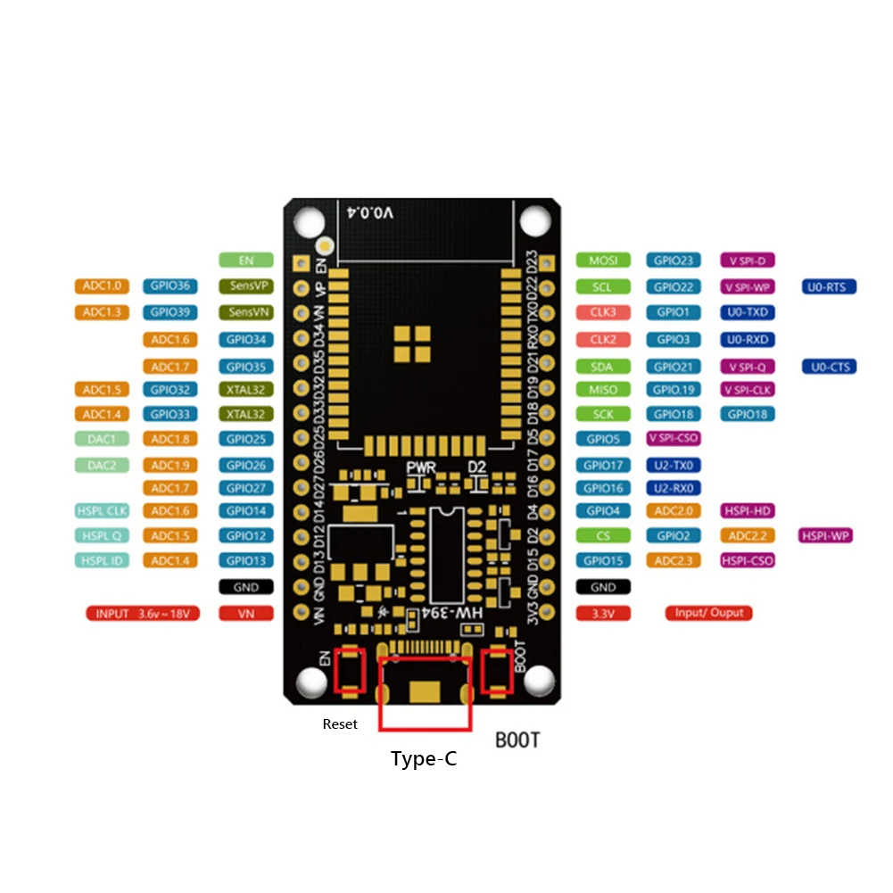
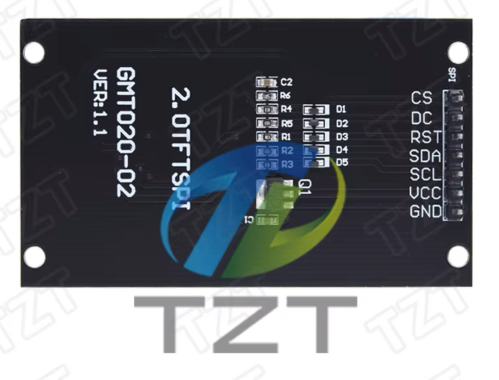

# Audio Selector ハードウェア・ピン割り当て

## 1. この文書について

本書は、Audio Selector バージョン1で使用するESP32-D系ボード、ST7789 LCD、5ポジションジョグスイッチのピン割り当てを定義する。

GPIO割り当てとLCDの電源電圧は本書の内容で確定とする。バージョン1の電源はUSB Type-Cからの5 V給電だけをサポートし、`VN`端子からの外部給電は使用しない。

参照したボード画像：



LCDモジュール画像：



画像および本書では、USB Type-Cコネクタを下側、ESP32アンテナを上側にした向きを基準とする。

## 2. 確定ピン割り当て

### 2.1 ST7789 LCD

LCDモジュールは、画像で確認できる次の7端子を持つ。

```text
CS
DC
RST
SDA
SCL
VCC
GND
```

4線式SPIで接続する。ここで`SDA`はSPIのMOSI、`SCL`はSPIクロックを意味し、I²C信号ではない。LCDからの読み出し端子と独立したバックライト制御端子はない。

| LCD信号 | ESP32接続先 | GPIO | 方向 | 用途 |
| --- | --- | ---: | --- | --- |
| `SCL` / `SCLK` | `GPIO18` | 18 | ESP32 → LCD | SPIクロック |
| `SDA` / `MOSI` | `GPIO23` | 23 | ESP32 → LCD | SPIデータ |
| `CS` | `GPIO16` | 16 | ESP32 → LCD | チップ選択、LOW有効 |
| `DC` / `A0` | `GPIO21` | 21 | ESP32 → LCD | データ/コマンド選択 |
| `RES` / `RST` | `GPIO22` | 22 | ESP32 → LCD | LCDリセット、LOW有効 |
| `GND` | `GND` | — | — | 共通GND |
| `VCC` | `3V3` | — | 電源 | 3.3 V |

GPIO18とGPIO23は、添付画像に記載されたVSPIの標準的なクロックおよびMOSI端子を使用する。

GPIO5は画像上で`V SPI-CS0`と示されているが、ESP32の起動ストラップ端子であるためLCDのCSには使用しない。代わりにGPIO16を使用する。ESP32ではSPIの信号をGPIOマトリクス経由で割り当てられるため、この構成で動作可能である。

### 2.2 5ポジションジョグスイッチ

ジョグスイッチの共通端子をGNDへ接続し、各方向端子を次のGPIOへ接続する。

| ジョグ入力 | ESP32接続先 | GPIO | ファームウェア設定 | 押下時 |
| --- | --- | ---: | --- | --- |
| `UP` | `GPIO25` | 25 | `INPUT_PULLUP` | LOW |
| `DOWN` | `GPIO26` | 26 | `INPUT_PULLUP` | LOW |
| `LEFT` | `GPIO27` | 27 | `INPUT_PULLUP` | LOW |
| `RIGHT` | `GPIO33` | 33 | `INPUT_PULLUP` | LOW |
| `CENTER` | `GPIO13` | 13 | `INPUT_PULLUP` | LOW |
| `COM` | `GND` | — | — | — |

すべてLOW有効とし、未押下時はESP32の内部プルアップでHIGHを維持する。ファームウェアはチャタリング除去を行う。配線が長い場合やノイズが問題になる場合は、各入力へ外付け10 kΩ プルアップを追加できる。

これらのGPIOは起動ストラップ端子ではないため、電源投入中にジョグスイッチを押したままでも起動モードへ影響しない。

## 3. 配線一覧

```text
ESP32                         ST7789 LCD
-----                         ----------
GPIO18  --------------------  SCL / SCLK
GPIO23  --------------------  SDA / MOSI
GPIO16  --------------------  CS
GPIO21  --------------------  DC / A0
GPIO22  --------------------  RES / RST
GND     --------------------  GND
3.3 V   --------------------  VCC

ESP32                         5-position Jog Switch
-----                         ---------------------
GPIO25  --------------------  UP
GPIO26  --------------------  DOWN
GPIO27  --------------------  LEFT
GPIO33  --------------------  RIGHT
GPIO13  --------------------  CENTER
GND     --------------------  COM
```

## 4. ファームウェア定数

ファームウェアでは、ピン番号を1か所にまとめて定義する。Arduino系フレームワークを使用する場合の例を示す。

```cpp
// ST7789 LCD
constexpr int PIN_LCD_SCLK = 18;
constexpr int PIN_LCD_MOSI = 23;
constexpr int PIN_LCD_CS   = 16;
constexpr int PIN_LCD_DC   = 21;
constexpr int PIN_LCD_RST  = 22;

// 5-position jog switch (active low)
constexpr int PIN_JOG_UP     = 25;
constexpr int PIN_JOG_DOWN   = 26;
constexpr int PIN_JOG_LEFT   = 27;
constexpr int PIN_JOG_RIGHT  = 33;
constexpr int PIN_JOG_CENTER = 13;
```

LCDのSPIホストはVSPIを使用する。MISOは`-1`または未割り当てとする。このLCDモジュールには外部バックライト制御端子がないため、バックライト用GPIOとLEDC設定は使用しない。

## 5. ESP32ボード上の物理端子順

添付画像から読み取れるピンヘッダー順を示す。USB Type-Cを下側にした状態で、上から下への順序である。実装前に実物のシルク印刷とも照合する。

| 左側ピンヘッダー | 右側ピンヘッダー |
| --- | --- |
| `EN` | `GPIO23` |
| `GPIO36` | `GPIO22` |
| `GPIO39` | `GPIO1` |
| `GPIO34` | `GPIO3` |
| `GPIO35` | `GPIO21` |
| `GPIO32` | `GPIO19` |
| `GPIO33` | `GPIO18` |
| `GPIO25` | `GPIO5` |
| `GPIO26` | `GPIO17` |
| `GPIO27` | `GPIO16` |
| `GPIO14` | `GPIO4` |
| `GPIO12` | `GPIO2` |
| `GPIO13` | `GPIO15` |
| `GND` | `GND` |
| `VN` / 電源入力 | `3V3` |

画像の表記だけで電源定格を確定してはならない。特に左下の`VN`端子はバージョン1では使用せず、電源を接続しない。

## 6. 使用しない、または予約する端子

| GPIO / 端子 | 方針 | 理由 |
| --- | --- | --- |
| `GPIO1` (`U0_TXD`) | 通常機能には使用しない | CH340C経由の書き込み・デバッグログ用 |
| `GPIO3` (`U0_RXD`) | 通常機能には使用しない | CH340C経由の書き込み・デバッグ用 |
| `GPIO0` | 使用しない | BOOT操作に使用される起動ストラップ端子 |
| `GPIO2`, `GPIO5`, `GPIO12`, `GPIO15` | 使用しない | 起動ストラップ端子。外部回路による起動失敗を防ぐ |
| `GPIO34`〜`GPIO39` | バージョン1では使用しない | 入力専用で内部プルアップ / プルダウンを持たない |
| `GPIO6`〜`GPIO11` | 使用禁止 | ESP32モジュール内部のSPIフラッシュメモリーに接続される |
| `GPIO19` | 予約 | SPI MISO候補。バージョン1ではLCD読み出しを行わない |
| `GPIO17` | 予約 | 将来拡張用 |
| `GPIO32` | 予約 | LCDにバックライト制御端子がないため未使用。将来拡張用 |
| `GPIO4`, `GPIO14` | 予約 | 将来拡張用 |

Bluetooth Classic SPPは内部周辺回路を使用するため、Bluetooth通信用GPIOの割り当てはない。GPIO1とGPIO3のUART0、およびCH340Cはファームウェア書き込みとデバッグだけに使用し、通常のAudio Selector通信には使用しない。

## 7. 電気的な注意事項

### 7.1 GPIO電圧

ESP32のGPIO論理電圧は3.3 Vであり、5 V耐性はない。LCDおよびジョグスイッチからGPIOへ3.3 Vを超える電圧を入力してはならない。

### 7.2 LCD電源

ST7789コントローラーとこのLCDモジュールは3.3 Vで使用する。`VCC`をESP32ボードの`3V3`へ接続し、LCDの電源および信号電圧を3.3 Vへ統一する。

接続時は次を守る。

- 信号線へは3.3 Vの論理信号だけを接続する。
- `VCC`には3.3 Vだけを接続し、5 Vを接続しない。
- 必要電流がESP32ボードの3.3 V出力能力内であることを確認する。
- この7ピンモジュールには`SDO` / `MISO`端子がないため、読み出し配線は行わない。

### 7.3 バックライト

このLCDモジュールには`BL`または`BLK`端子がなく、7ピンヘッダーからバックライトを独立制御できない。画像上では基板にトランジスター`Q1`と抵抗類が実装されているが、その回路動作を画像だけから断定しない。

バージョン1では、バックライトは`VCC`給電中に常時点灯する前提とし、明るさ調整および消灯制御を実装しない。GPIOを基板上の部品へ直接接続したり、基板を改造したりしない。

### 7.4 外部電源

バージョン1はESP32ボードのUSB Type-Cコネクターへ安定化された5 Vを供給する。`VN`端子の許容入力電圧、レギュレーター、逆流防止構成を実物資料から確定できないため、`VN`端子からの外部給電はサポート対象外とし、電源を接続しない。

USB Type-C給電と別の電源を同時に接続してはならない。将来`VN`端子を使用する場合は、ボードの正確な型番、回路、許容電圧、極性、逆流防止を確認したうえで別バージョンの仕様として追記する。

## 8. 組み立て前の確認項目

- [ ] 実物ボードのシルク印刷と5節の端子順が一致する
- [x] LCDモジュールが7ピン構成（`CS`, `DC`, `RST`, `SDA`, `SCL`, `VCC`, `GND`）である
- [x] LCDの`VCC`を3.3 Vで使用する
- [x] 外部バックライト制御端子がないことを確認した
- [ ] ジョグスイッチの共通端子と各方向端子を導通確認した
- [ ] すべてのGNDが共通になっている
- [x] バージョン1はUSB Type-C 5 V給電のみとし、`VN`端子を使用しない
- [ ] 電源投入前にGPIOと電源間の短絡がないことを確認した

## 9. 割り当て概要

| 機能 | GPIO |
| --- | ---: |
| LCD SCLK | 18 |
| LCD MOSI | 23 |
| LCD CS | 16 |
| LCD DC | 21 |
| LCD RST | 22 |
| ジョグ UP | 25 |
| ジョグ DOWN | 26 |
| ジョグ LEFT | 27 |
| ジョグ RIGHT | 33 |
| ジョグ CENTER | 13 |
